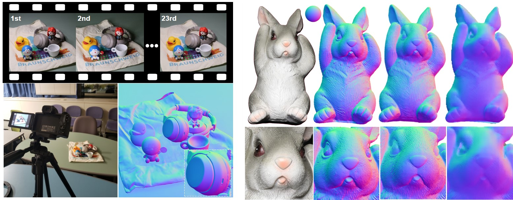
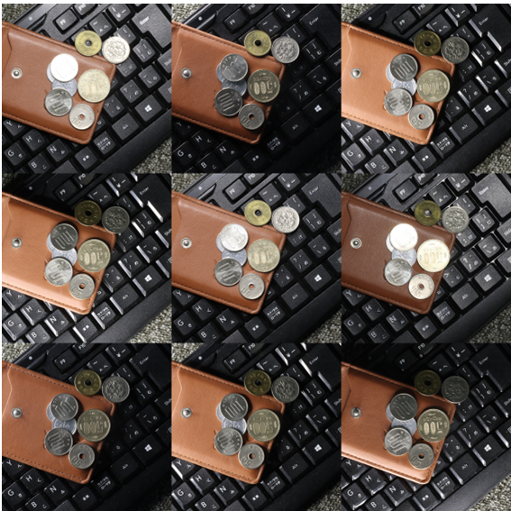
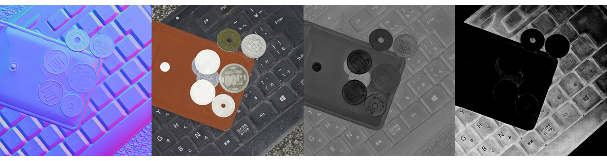
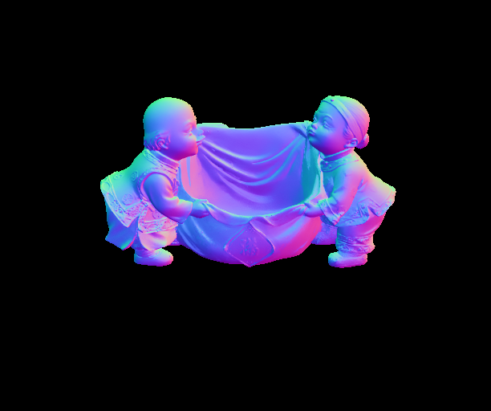
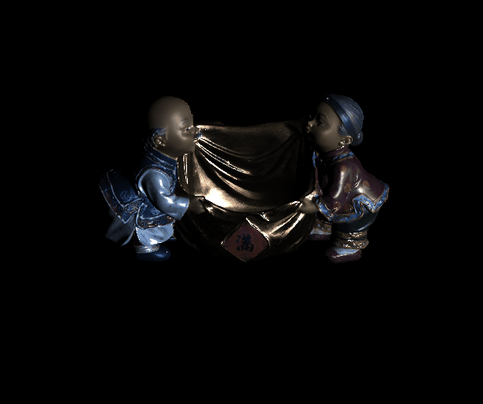

## SDM-UniPS: Scalable, Detailed, and Mask-Free Universal Photometric Stereo (CVPR2023 Hightlight)

<p align="center">
  
</p>

**Author:** Satoshi Ikehata (National Institute of Informatics https://satoshi-ikehata.github.io/)

**Conference:** IEEE/CVF Computer Vision and Pattern Recognition (CVPR), 2023

**Arxiv:** https://arxiv.org/abs/2303.15724

**Abstract:**
SDM-UniPS is a Scalable, Mask-free, and Universal Photometric Stereo Network. This method can recover remarkably intricate surface normal maps, rivaling the quality of 3D scanners, even when images are captured under unknown, spatially-varying lighting conditions in uncontrolled environments. I provide not only a model for normal map estimation but also one for BRDF parameters (base color, roughness, and metallic), as shown in the appendix. Additionally, I offer the code for creating a video from frames rendered under novel directional light sources using both the normal and BRDF parameters.

## 🚀 Steps to Get Started

### Step 1: Install Dependencies
Following instructions below.

### Step 2: Image Acquisition
Take multiple images under different arbitrary lighting conditions
<p align="center">
  
</p>

### Step 3: Run the Code
Run main.py to recover the surface normal map and BRDF maps (base color, roughness, metallic)
<p align="center">
  
</p>

### Step 4: Novel Relighting
Run relighting.py to render images under novel directional lightings based on recovered normal map and BRDF maps
<p align="center">
  
</p>

## Required Dependencies
To successfully run the universal photometric stereo network, ensure that your system has the following dependencies installed:

- Python 3
- PyTorch
- OpenCV (cv2)
- Einops
- imageio (only for relighting)

## Tested Configurations
The network has been successfully tested on the following configurations:

- Ubuntu 20.04.5 and Windows 11, Python 3.11.3, PyTorch 2.0 with CUDA 11.8
- GPU: Nvidia RTX A6000 (48GB)

## Dataset Preparation
To run the universal photometric stereo network, you need shading images and an optional binary object mask. The object should be illuminated under arbitrary lighting sources, but shading variations should be sufficient (weak shading variations may result in poor results).

Organize your test data as follows (prefix "L" and suffix ".data" can be modified in main.py):

```
YOUR_DATA_PATH
├── A (Suffix: default ".data")
│   ├── mask.png (optional)
│   ├── [Prefix (default: "L")] imgfile1
│   ├── [Prefix (default: "L")] imgfile2
│   └── ...
└── B (Suffix: default ".data")
    ├── mask.png (optional)
    ├── [Prefix (default: "L")] imgfile1
    ├── [Prefix (default: "L")] imgfile2
    └── ...
```

## Download Pretrained Models
Checkpoints of the network parameters for recovering both normal maps and BRDF maps are available [here](https://www.dropbox.com/s/yu8h6g0zp07mumd/checkpoint.zip?dl=0).

To use the pre-trained models, extract them as follows:

```
checkpoint
├── normal
│   └── nml.pytmodel
└── brdf
    └── brdf.pytmodel
```

## Running the Test
You can simply try the code using some datasets in my paper from [this link](https://www.dropbox.com/sh/afm4lkiz0iu1un3/AACfdKB66wl8iyFtJ4fzynGYa?dl=0).

To run the test, execute `main.py` with the following command:

```
python sdm_unips/main.py --session_name YOUR_SESSION_NAME --test_dir YOUR_DATA_PATH --checkpoint YOUR_CHECKPOINT_PATH
```

or

```
python sdm_unips/main.py --session_name YOUR_SESSION_NAME --test_dir YOUR_DATA_PATH --checkpoint YOUR_CHECKPOINT_PATH --scalable
```
The 'scalable' option is a powerful feature not included in the original paper. At the cost of some accuracy and computational expense, it enables normal and brdf estimation at any resolution with constant GPU memory consumption. For example, in the original implementation, inputting ten 2048x2048 resolution images consumes over 40GB of memory, but using this option reduces consumption to around 10GB. This consumption is proportional to the number of images but does not vary with resolution. The trick is very simple and I will add some details in the future. If you input images larger than 1024x1024, I highly recommend you to use this option.

If you don't need to recover either of normal map or brdf maps, please use specific options as

```
python sdm_unips/main.py --session_name YOUR_SESSION_NAME --test_dir YOUR_DATA_PATH --checkpoint YOUR_CHECKPOINT_PATH --target normal
```

or

```
python sdm_unips/main.py --session_name YOUR_SESSION_NAME --test_dir YOUR_DATA_PATH --checkpoint YOUR_CHECKPOINT_PATH --target brdf
```

By default, the maximum number of images to load is set to 10, and the maximum resolution is set to 4096x4096, regardless of the number of images or the resolution in the data directory. If you want to change these numbers, please specify options as follow.

```
python sdm_unips/main.py --session_name YOUR_SESSION_NAME --test_dir YOUR_DATA_PATH --checkpoint YOUR_CHECKPOINT_PATH --max_image_res 10000 --max_image_num 100
```

The results will be saved in `YOUR_SESSION_NAME/results`. You will find a normal map and BRDF maps (base color, roughness, and metallic).

You can also use the provided code (`relighting.py`) for relighting the object under novel directional lights based on the recovered attributes. Follow the instructions displayed at the end of the prompt to use it. It should look like this.

To output .avi video:
```
 python sdm_unips/relighting.py --datadir ./YOUR_SESSION_NAME/results/OBJECT_NAME.data --format avi
```

To output .gif video:

```
 python sdm_unips/relighting.py --datadir ./YOUR_SESSION_NAME/results/OBJECT_NAME.data --format gif
```
## Quantitative Evaluation on DiLiGenT
If you want to compute the mean angular errors between predicted and ground truth surface normal maps in DiLiGenT benchmark, simply organize the data as in others and put 'Normal_gt.png' in the directory. The code automatically computes the MAE and displays it. Please note that there are randomized processes in the estimation framework, and the results change with every prediction.

<p align="center">
  
  
</p>


## Important Notice
This repository is for testing purposes only. I do not currently plan to release the training script and training data, unlike my previous projects. Please refrain from sending email requests for these resources.

## License

This project is licensed under the MIT License with a non-commercial clause. This means that you are free to use, copy, modify, and distribute the software, but you are not allowed to use it for commercial purposes. 

Copyright (c) [2023] [Satoshi Ikehata]

## Citation

If you find this repository useful, please consider citing this paper:

```bibtex
@inproceedings{ikehata2023sdmunips,
  title={Scalable, Detailed and Mask-free Universal Photometric Stereo},
  author={Satoshi Ikehata},
  booktitle={Proceedings of the IEEE/CVF Conference on Computer Vision and Pattern Recognition (CVPR)},
  year={2023}
}

